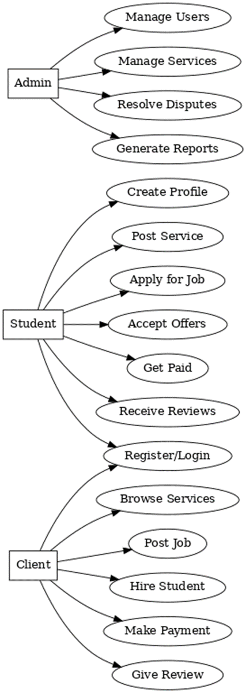
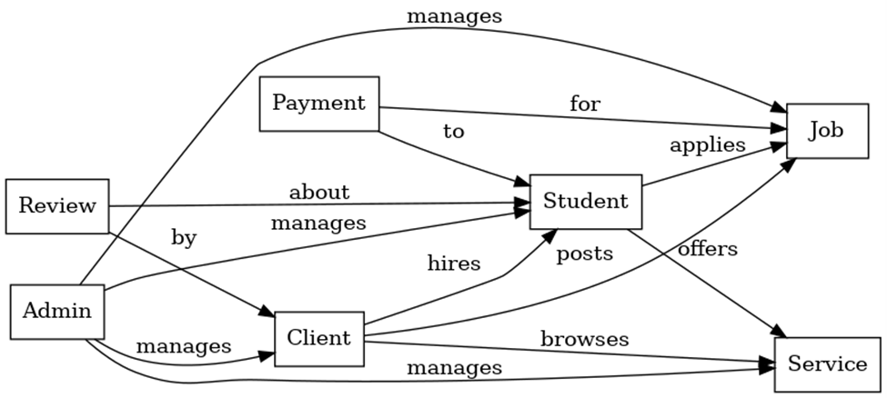

💼 Student Freelance Marketplace – Detailed Description
🎯 Project Goal
To create a platform where students can offer freelance services (like tutoring, coding, design, writing), and clients (teachers, peers, small businesses) can hire them.
This helps students earn, build portfolios, and gain real-world work experience.
________________________________________
👥 User Roles
1.	Admin
o	Manages platform, approves users/services.
o	Monitors disputes & transactions.
2.	Student Freelancer
o	Creates profile with skills, portfolio, hourly/project rates.
o	Lists services (e.g., “Web Design”, “JavaScript tutoring”).
o	Accepts/declines job requests.
o	Gets paid after work completion.
3.	Client (Employer)
o	Browses services or posts job requests.
o	Hires students for projects.
o	Makes payments & leaves reviews.
________________________________________
🛠️ Core Functionalities
🔑 Authentication & Profiles
•	Register/Login with JWT
•	Role-based access: Admin, Student, Client
•	Profile setup: photo, bio, skills, portfolio links
📂 Service Management
•	Students create/edit services (title, description, price, category).
•	Clients browse services by category/skills.
•	Search & filter (e.g., “React developer” or “Math tutor”).
💬 Job Posting & Hiring
•	Clients can post a job request.
•	Students apply with proposals.
•	Clients hire from applicants.
💳 Payment Integration
•	Payment gateway (Stripe/PayPal).
•	Secure escrow: client pays → held until job finished → student gets funds.
⭐ Reviews & Ratings
•	Clients leave feedback for students.
•	Builds student credibility & ranking.
📊 Dashboard & Analytics
•	Student: earnings, completed jobs, reviews.
•	Client: spending, hired freelancers, ratings.
•	Admin: overall platform statistics.
________________________________________
🏗️ Tech Stack
•	Frontend: React + Tailwind
•	Backend: Node.js + Express
•	Database: MongoDB
•	Auth: JWT + bcrypt
•	Payments: Stripe/PayPal API
•	Deployment: Docker + Vercel/Netlify (frontend), Render/Heroku (backend)
________________________________________
🌟 Extra Features (for wow factor)
•	Chat system (real-time using Socket.io).
•	AI job matcher → recommends best students for a job.
•	Notification system (email/real-time).
________________________________________

📘 Project Proposal – Student Freelance Marketplace
1. Project Title
Student Freelance Marketplace: A Platform for Student Talent and Opportunities
________________________________________
2. Problem Statement
Many students have valuable skills in programming, design, tutoring, content writing, and other fields. However, they often lack a platform to showcase these skills and connect with potential clients. On the other hand, individuals and small businesses face difficulty finding affordable and motivated talent.
Existing freelance platforms (like Fiverr or Upwork) are not tailored to students, often requiring high competition, professional portfolios, and global exposure that may overwhelm beginners.
Therefore, there is a need for a dedicated marketplace that connects students with clients, enabling them to earn income, gain real-world experience, and build their professional portfolio.
________________________________________
3. Objectives
🎯 General Objective
To design and develop a web-based freelance marketplace where students can showcase their skills, offer services, and get hired by clients in a secure and user-friendly environment.
📌 Specific Objectives
1.	To provide a secure authentication system for students, clients, and admins.
2.	To enable students to create and manage service listings with descriptions, pricing, and categories.
3.	To allow clients to browse, search, and hire students for services or projects.
4.	To implement a payment system ensuring secure transactions between clients and students.
5.	To provide ratings and reviews for students to build credibility.
6.	To give admins the ability to monitor and manage the platform (users, disputes, reports).
7.	To offer a dashboard for students, clients, and admins with useful analytics.
________________________________________
4. Scope of the Project
The system will include:
•	Student Features: profile creation, service posting, job application, earnings tracking.
•	Client Features: service browsing, job posting, hiring, payment, feedback.
•	Admin Features: user management, report handling, platform analytics.
•	System Features: secure payments, notifications, search & filter, review system.
Out of scope: advanced AI features, large-scale scalability (future improvements).
________________________________________
5. Use Cases
👩‍🎓 Student (Freelancer)
•	Sign up and set up profile.
•	Post services (e.g., “Logo Design – $50”).
•	Apply for posted jobs.
•	Accept/decline client offers.
•	Receive payment after completing tasks.
•	Get ratings & reviews.
👨‍💼 Client (Employer)
•	Sign up and browse services.
•	Post job requests with details.
•	Hire student freelancers.
•	Make secure payments.
•	Review student performance.
👩‍💻 Admin
•	Manage users and services.
•	Handle disputes or reports.
•	View overall platform performance analytics.
________________________________________
6. Proposed System Architecture
•	Frontend: React + Tailwind CSS
•	Backend: Node.js + Express
•	Database: MongoDB
•	Authentication: JWT & bcrypt
•	Payments: Stripe/PayPal API
•	Real-time Features: Socket.io (chat & notifications)
________________________________________
7. Expected Outcome
•	A fully functional web application where students can connect with clients.
•	Students gain income and experience, clients get affordable services, and admins maintain platform quality.
•	A scalable system that can be expanded into a startup idea in the future.

1️⃣ Use Case Diagram (shows system functionality for each role)
Actors:
•	Student (Freelancer)
•	Client (Employer)
•	Admin
Use Cases:
•	Student: Register/Login, Create Profile, Post Services, Apply for Jobs, Accept Offers, Get Paid, Receive Reviews.
•	Client: Register/Login, Browse Services, Post Jobs, Hire Students, Make Payment, Give Reviews.
•	Admin: Manage Users, Manage Services, Resolve Disputes, Generate Reports.
The diagram would look like:

[Student] ---------------- (Register/Login)
           --------------- (Create Profile)
           --------------- (Post Service)
           --------------- (Apply for Job)
           --------------- (Accept Offers)
           --------------- (Get Paid)
           --------------- (Receive Reviews)

[Client] ----------------- (Register/Login)
          ---------------- (Browse Services)
          ---------------- (Post Job)
          ---------------- (Hire Student)
          ---------------- (Make Payment)
          ---------------- (Give Review)

[Admin] ------------------ (Manage Users)
         ----------------- (Manage Services)
         ----------------- (Resolve Disputes)
         ----------------- (Generate Reports)

2️⃣ System Architecture Diagram
Layers:
•	Frontend (React + Tailwind)
o	Student Dashboard
o	Client Dashboard
o	Admin Panel
•	Backend (Node.js + Express)
o	Authentication Service (JWT)
o	Freelance Service Module (jobs, offers, services)
o	Payment Service (Stripe/PayPal)
o	Review & Rating Module
o	Admin Management
•	Database (MongoDB)
o	Users Collection (Students, Clients, Admins)
o	Services Collection
o	Jobs Collection
o	Payments Collection
o	Reviews Collection
•	External APIs
o	Payment Gateway (Stripe/PayPal)
o	Email/Notification Service
Flow Example:
👉 Client browses → Frontend → Backend API → MongoDB → Result displayed
👉 Student accepts job → Backend → Payment API → Confirmed → Notification sent

            Use Case Diagram

  

  🎓 Actors & Their Roles
1.	Student (Freelancer)
o	Register/Login → create an account or sign in.
o	Create Profile → add skills, portfolio, experience, etc.
o	Post Service → list services (e.g., “Web Development”, “Graphic Design”).
o	Apply for Job → submit proposals for jobs posted by clients.
o	Accept Offers → approve when a client hires them.
o	Get Paid → receive payment after project completion.
o	Receive Reviews → get feedback and ratings from clients.
________________________________________
2.	Client (Job Poster/Service Seeker)
o	Register/Login → create an account or sign in.
o	Browse Services → search and view services offered by students.
o	Post Job → describe a project and invite students to apply.
o	Hire Student → select and hire a freelancer for a job.
o	Make Payment → pay securely through the platform.
o	Give Review → leave ratings and feedback for students.
________________________________________
3.	Admin (Platform Owner/Moderator)
o	Manage Users → approve, suspend, or delete accounts.
o	Manage Services → monitor and remove inappropriate services.
o	Resolve Disputes → handle conflicts between clients and students.
o	Generate Reports → system statistics (earnings, usage, etc.).
________________________________________
✨ In summary:
•	Students offer services or apply for jobs.
•	Clients hire students or buy services.
•	Admins ensure everything runs smoothly.

  ER Diagram (Entity-Relationship Diagram)

     